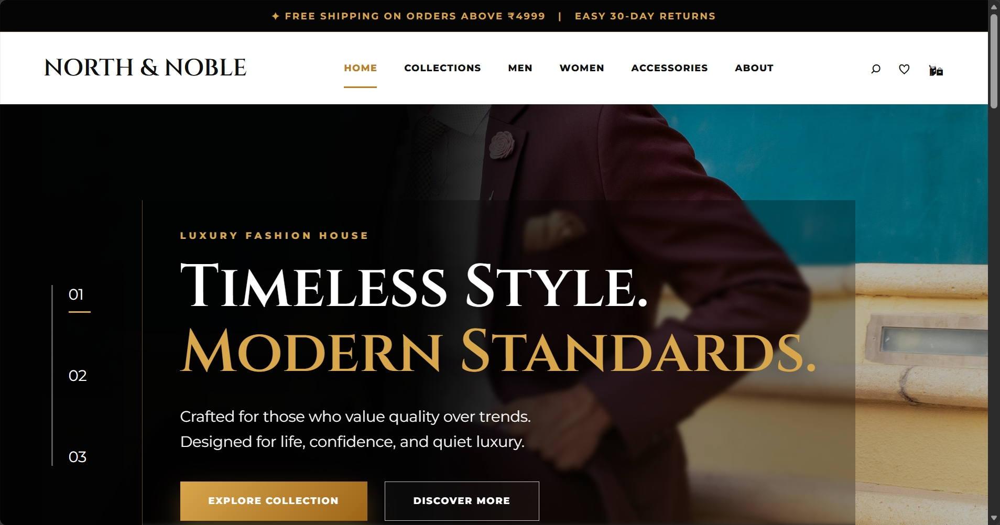
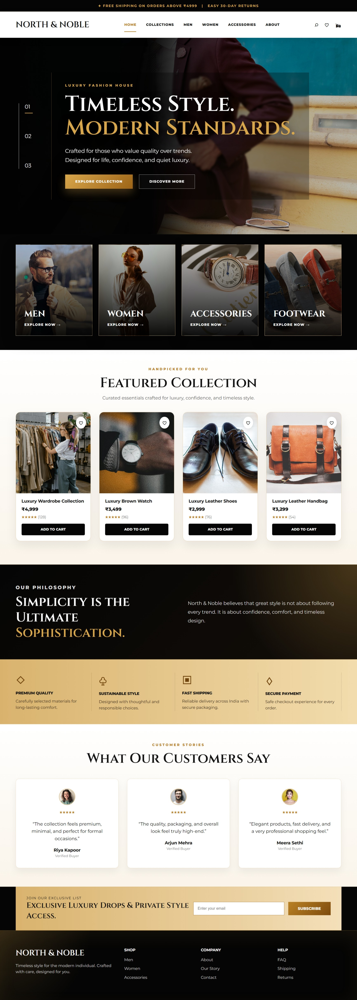

# North & Noble

A premium luxury fashion storefront built using React, Vite, Supabase, and React Router.

**Live Demo:** https://north-noble.vercel.app/


## Project Overview

North & Noble is a modern fashion storefront inspired by luxury retail brands. The project was initially developed as a static React homepage and later enhanced with dynamic product management, category-based navigation, and Supabase integration.

The application demonstrates component-based architecture, client-side routing, database connectivity, and admin-controlled product management while maintaining a clean and premium user experience.

## Key Features

* Premium luxury-inspired user interface
* Responsive design
* Component-based React architecture
* React Router navigation
* Category-based product filtering
* Dynamic product management
* Supabase database integration
* Admin Add Product panel
* Featured Collection section
* Customer testimonials and newsletter section

## Tech Stack

* React
* Vite
* JavaScript
* CSS3
* React Router DOM
* Supabase
* Git
* GitHub

## Screenshots

### Hero Section



<br>

### Full Homepage



## Supabase Integration

Supabase is used to store and manage product data dynamically. Products added through the admin panel are saved to the database and displayed automatically within the storefront.

Environment variables are managed securely using a local `.env` file, which is excluded from version control.

## Admin Product Management

The project includes an admin product management system that allows products to be added directly from the application interface.

Supported fields:

* Product Name
* Price
* Category
* Image URL
* Reviews

Products submitted through the admin panel are stored in Supabase and displayed dynamically based on their assigned category.

Admin access can be controlled through:

```js
const isAdmin = true;
```

## Installation

Clone the repository:

```bash
git clone https://github.com/pritiimishraa12/North-Noble.git
```

Install dependencies:

```bash
npm install
```

Create a `.env` file in the project root and add your Supabase credentials:

```env
VITE_SUPABASE_URL=your_supabase_url
VITE_SUPABASE_PUBLISHABLE_KEY=your_supabase_publishable_key
```

Run the development server:

```bash
npm run dev
```

## Learning Outcomes

Through this project, I gained practical experience with:

* React component architecture
* React Router navigation
* Dynamic data handling
* Supabase integration
* Admin-based product management
* Environment variable management
* Responsive UI development
* Git and GitHub workflow

## Author

Priti Mishra

## Project Status

North & Noble has evolved from a static React homepage into a dynamic mini e-commerce storefront featuring routing, Supabase-powered product management, and an admin-controlled product system.
